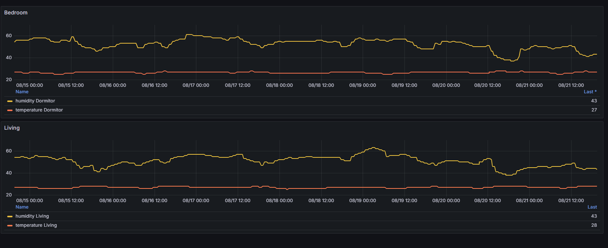

# Home Automation System

## Overview

This project is a home automation system designed monitor Tuya & SonOff humidity and temperature sensors. 

  

The system is containerized using Docker and uses Terraform for infrastructure deployment, tailored to work on AWS.


## Features

- **Device Control:** Manage and monitor connected home devices.
- **Automation:** Automate the monitoring of humidity and temperature.
- **Scalability:** Easily deployable on AWS using Terraform.
- **Containerization:** Docker and Docker Compose are used for easy deployment and environment consistency.

## Project Structure

- **`docker-compose.yaml`:** Defines the Docker services and configurations required to run the project.
- **`Dockerfile`:** Instructions for building the Docker image used by AWS Lambda.
- **`terraform/`:** Contains Terraform files for deploying necessary infrastructure on AWS, including the ECR and Lambda setup.
- **`main.py` & `requirements.txt`:** The main application triggered by Lambda and its Python dependencies.

## Prerequisites

- **Lightsail/EC2 Instance/Any Other VM:** An AWS Lightsail, EC2 instance, or any other VM with public internet access. Lambda must be allowed to push data to InfluxDB, which will be hosted on this VM.
- **Docker and Docker Compose:** Ensure Docker and Docker Compose are installed on your system.
- **Terraform:** Install Terraform to deploy the infrastructure.
- **Tuya cloud access:** - You need to have tuya cloud configured as you need the api key, api secret and api region.

## Setup Instructions

1. **Clone the Repository**
   ```bash
   git clone <repository-url>
   cd home-automation

2. **Configure variables required by terraform**
   ```bash
   cat <<EOF > terraform.tfvars
   influxdb_url      = "IP/Doamin address of your VM (e.g. hello-world.com:8086"
   influxdb_token    = "REPLACE-ME-AT-STEP-7"
   influxdb_org      = "REPLACE-ME-AT-STEP-7"
   influxdb_bucket   = "REPLACE-ME-AT-STEP-7"
   tuya_apikey       = ""
   tuya_apisecret    = ""
   tuya_apisregion   = ""
   EOF

3. **Create the ECR and set the ECR_REGISTRY url as env. variable**
   ```bash
   cd terraform
   terraform init
   terraform apply --target=aws_ecr_repository.home_autiomation
   ECR_REGISTRY=$(terraform output ecr_repository_url)

4. **Build the docker image, tag it and push it to the ECR you crated with earlier**

   ```bash
   docker build -t home-automation .
   docker tag $ECR_REPOSITORY:latest $ECR_REGISTRY/$ECR_REPOSITORY:latest
   docker push $ECR_REGISTRY/home_automation:latest

5. **Start the Application  with docker compose**
  Before starting the application, you need to configure your grafana admin and password. These are taken from env. variables
   ```bash
   ADMIN_USER="admin"
   ADMIN_PASSWORD="password"
   docker-compose up -d

6. **Configure influxDB**

   Login into influx DB and create both your new organization and bucket.
   You will also need to create a new token to configure in the lambda, so it can access your influxDB.


7. **Update lambda**
  
   Update values.tfvars with proper values and run ```terraform apply```
   This will update the lambda with proper access to your influxDB. 


8. **Optionally: Import grafana dashboard**
   
   After you log in into grafana (your-domain.tld:3000) you need to configure influxDB as your data source. 

   After that, you can import the grafana dashboard found in grafana/dashboard.json


# Usage

## Accessing the system

After deployment, access Grafana or InfluxDB via the exposed ports or the configured domain. 
The specific ports or domain setup should be detailed in your Terraform or Docker Compose configuration.

# License

This project is licensed under the MIT license.
